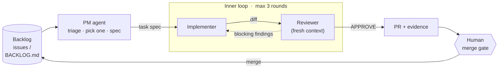

<div align="center">

# Agentic Monorepo Template

**A stack-agnostic monorepo template where agents are the workflow, not the helpers.**

[](https://github.com/chrille0313/agentic-monorepo-template/actions/workflows/ci.yml)
[](LICENSE)
[](https://www.conventionalcommits.org/en/v1.0.0/)
[](https://code.claude.com/docs)
[](https://github.com/chrille0313/agentic-monorepo-template/generate)

[How it works](#how-it-works) ·
[Quick start](#quick-start) ·
[Execution modes](#execution-modes) ·
[Safety rails](#safety-rails) ·
[Design rationale](docs/DESIGN.md)

</div>

Plan a feature once, then let the pipeline carry it: a **PM agent** triages the backlog and writes build-ready specs, an **implementer agent** builds each slice, and a **fresh-context reviewer** tries to break it, all on top of deterministic CI gates that no agent can talk past. You hold the merge button. Built entirely on Claude Code primitives: subagents, skills, workflows, and GitHub Actions.

## How it works



- **Inner loop** (evaluator-optimizer): the boxed cycle. The implementer builds against a task spec, then a reviewer with completely fresh context judges the diff, grounded in commands it actually ran. Findings cycle back until approval, an iteration cap, or a no-progress exit.
- **Outer loop** (orchestrator-workers): the full circuit. The PM owns the backlog: it triages, unblocks, picks the most valuable ready item, shapes the spec, and dispatches it into the inner loop. A merge closes the circle.

> [!IMPORTANT]
> Agents never merge. Every PR arrives carrying its evidence (criteria mapping, review history, executed verification), and a human holds the merge gate. Enable branch protection on `main` before turning on the autonomous modes.

## Quick start

1. **[Use this template](https://github.com/chrille0313/agentic-monorepo-template/generate)**, then open your new repo in Claude Code.
2. Run `/setup-stack` to pick your language and framework. The agent scaffolds a minimal, agent-testable project and fills in the [command contract](CLAUDE.md#command-contract) every other agent verifies against.
3. Run `/plan <your first feature>` and answer its questions; it fans the approved plan out into build-ready issues.
4. Run the loop:

| Command | What it does |
|---|---|
| `/plan <feature>` | Interactive planning interview, then spec-formatted, dependency-ordered issues |
| `/build <description or #issue>` | Runs the inner loop on one task, with you at the merge gate |
| `/pm` | Runs the outer loop once: triage, pick the next item, spec it, offer to build |
| `/pm --dispatch` | Same, but dispatches by labeling the issue `agent` (triggers CI) |

## Execution modes

| Mode | Trigger | Your role |
|---|---|---|
| **Local** | `/build` or `/pm` in a Claude Code session | Watch, steer, approve the PR |
| **CI, event-driven** | Add the `agent` label to an issue | Review the PR that arrives |
| **CI, autonomous** | Scheduled PM cron (opt-in, off by default) | Review PRs as the backlog drains |

The CI modes need one auth secret: `CLAUDE_CODE_OAUTH_TOKEN` to bill a Claude Pro/Max subscription (generate with `claude setup-token`), or `ANTHROPIC_API_KEY` for pay-per-token API billing.

> [!TIP]
> Prefer the subscription token for personal repos; it makes headless runs effectively free, but they share your plan's usage limits with your interactive sessions.

## Repo layout

```
apps/              deployable applications, one directory per app (filled by /setup-stack)
packages/          shared libraries used by apps
.claude/
  agents/          pm, implementer, reviewer: the actors, each with its own context and tools
  skills/          /plan (idea to issues), /build (inner loop), /pm (outer loop),
                   /setup-stack (one-time adapt)
  workflows/       feature-loop.js, a deterministic scripted variant of the inner loop
.github/workflows/ ci.yml (contract gates, commit lint, workflow lint, security scan),
                   agent-task.yml (label-triggered inner loop), pm-cron.yml (scheduled PM)
docs/DESIGN.md     the research-backed rationale for every design choice
BACKLOG.md         local backlog fallback when GitHub Issues aren't available
CLAUDE.md          conventions + the command contract every agent relies on
```

The `apps/` + `packages/` layout is fixed regardless of stack; the workspace *tooling* underneath (pnpm workspaces, cargo workspaces, Nx, moon, none) is chosen per stack by `/setup-stack`. A predictable structure is what keeps agent navigation and conventions identical across every repo built from this template.

## Safety rails

Every rail below traces to published evidence; see [docs/DESIGN.md](docs/DESIGN.md) for the receipts.

- **Deterministic gates beneath review.** Check, test, and build run in CI on every PR and must be green before a review round even starts. Agent review layers on top of machinery that can't be talked past.
- **Grounded review.** The reviewer sees only the spec and the diff, never the implementer's reasoning, and a blocking finding requires evidence the reviewer *executed*: a failing command, a reproduced wrong output. Agents verify behavior through the contract's `run`/`smoke` path, not just compilation.
- **Bounded loops at three levels.** At most 3 implement/review rounds with a no-progress early exit, `--max-turns` caps any single agent, and workflow timeouts cap each CI run.
- **No consensus-seeking.** Disputed findings go to an independent judge (or the human, locally). The implementer and reviewer never negotiate each other into agreement.
- **Informed human merge gate.** PRs carry criteria mapping, severity-ranked findings, and executed verification evidence, so merging is an informed check rather than a rubber stamp.
- **Spec-driven.** Nothing is implemented without acceptance criteria; the PM decomposes anything too big for one PR.
- **Tests are a floor.** An independent security scan runs in CI, and the reviewer explicitly judges whether the tests themselves are meaningful.

## Adapting the template

- **Swap the stack**: rerun `/setup-stack`, or hand-edit the command contract in [CLAUDE.md](CLAUDE.md).
- **Add actors**: drop a new agent in `.claude/agents/` (a security reviewer, say) and reference it from the `/build` skill's review phase.
- **Tune autonomy**: the spectrum runs from `/build` with you watching to a cron'd PM feeding a labeled-issue pipeline you only see as incoming PRs.

---

<div align="center">
<sub>Maintained by its own pipeline: the loops in this repo build this repo.</sub>
</div>
